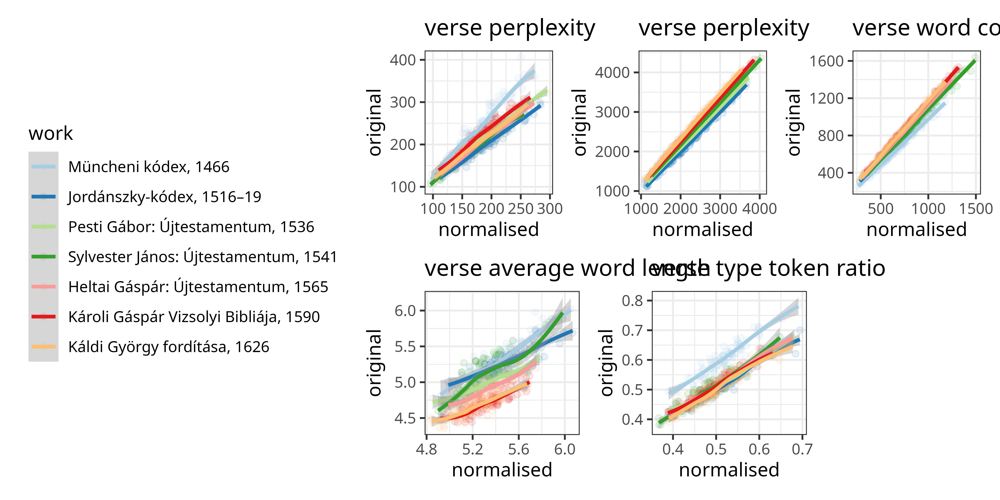

# Text density across mediaeval Hungarian translations of the Gospel

Rácz, Péter

## translations used

1. Müncheni kódex, 1466                            
2. Pesti Gábor: Újtestamentum, 1536                
3. Sylvester János: Újtestamentum, 1541            
4. Heltai Gáspár: Újtestamentum, 1565              
5. Károli Gáspár Vizsolyi Bibliája, 1590           
6. Káldi György fordítása, 1626                    
7. Magyar Bibliatársulat újfordítású Bibliája, 2014

## structure

- dat
	- bible_matcher.tsv: descriptions from https://parallelbible.nytud.hu/
	- gospel_entropy.tsv: entropies and other information stats across verses
	- gospels.gz: combined gospel texts
	- gospel_bigram_informativity.gz: bigram informativity across gospel verses
	- gospel_trigram_informativity.gz: trigram ~
- script
	- model.R: fit stan models
	- setup.R: add info measures to gospels.gz
	- source.R: draw data from clone of https://github.com/nytud/parallelbible
	- viz.R: draw viz. model preds are drawn in model.R
- viz
	- gospel_stats_correlations.png: correlations of stats calced on normalised and original verses
	- gospel_stats_original.png: stats calced on original verses
	- gospel_stats_normalised.png: ~ normalised verses
	- predictions.png: model predictions

## data dict

gospels.gz

- chr (7): translation, description, type, file_name, book, line, text
- dbl (2): year, verse

gospel_entropy.tsv

 - translation     : chr ... translation short name
 - year            : num ... translation year (see original info)
 - description     : chr ... description from original
 - type            : chr ... type: original facsimile text (betuhu), normalised, or modern
 - book            : chr ... Mt, Mk, Lk, Jn
 - verse           : num ... verse num
 - entropy         : num ... verse entropy, see script/setup.R
 - perplexity      : num ... verse perplexity, ~
 - wc              : num ... verse word count, ~
 - avg_word_length : num ... verse avg word length, ~
 - type_count      : num ... verse type count, ~
 - type_token_ratio: num ... verse type / token ratio, ~

## text densities

Text is either original / facsimile or normalised. Here's Mark 6:11.

| Original | Normalised | English |
|----------|------------|---------|
| ⁊ valakic nē ſogadandnac tu̇to̗ket  onnan ki mènuen leraʒiatoc a· poꝛt tu̇ labatocꝛol o̗ nèkic tanoſagoca / | és valakik nem fogadnak titeket , onnan kimenvén lerázzátok a port ti lábatokról őnekik tanúságukra . | And if any place will not welcome you or listen to you, leave that place and shake the dust off your feet as a testimony against them. |

For the 2014 translation, the two are the same.

We calculate the perplexity of individual verses in the four Books of the Gospel across translations for original / normalised.

Perplexity is an exponential function of entropy.

$\text{Perplexity} = 2^{\text{entropy}}$

Entropy is a measure of the unpredictability of a text. Sort of.

$H(X) = - \sum_{i=1}^{n} P(x_i) \log_2 P(x_i)$

Entropy is shaped by the size of the underlying vocabulary and text size. So we need to keep an eye on the length of verses.

Measures correlate for original and normalised, but this varies across translations.

We fit a LM predicting perplexity ~ translation * wc + book. (best model according to LOO)

