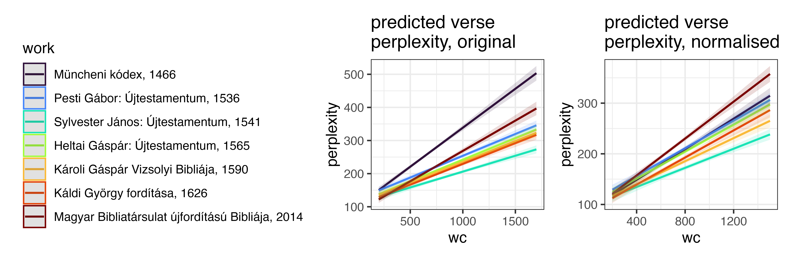
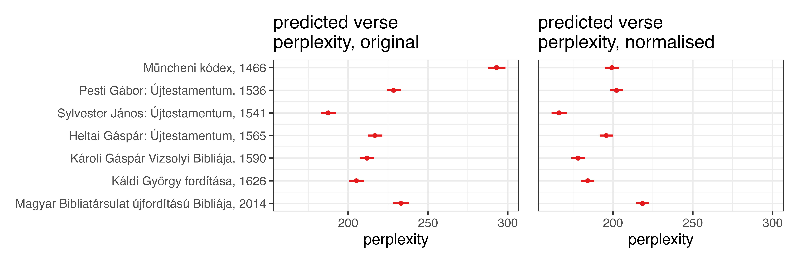

# Text density across mediaeval Hungarian translations of the Gospel

Rácz, Péter

## translations used

1. Müncheni kódex, 1466                            
2. Pesti Gábor: Újtestamentum, 1536                
3. Sylvester János: Újtestamentum, 1541            
4. Heltai Gáspár: Újtestamentum, 1565              
5. Károli Gáspár Vizsolyi Bibliája, 1590           
6. Káldi György fordítása, 1626                    
7. Magyar Bibliatársulat újfordítású Bibliája, 2014

## structure

- dat
	- bible_matcher.tsv: descriptions from https://parallelbible.nytud.hu/
	- gospel_entropy.tsv: entropies and other information stats across verses
	- gospels.gz: combined gospel texts
	- gospel_bigram_informativity.gz: bigram informativity across gospel verses
	- gospel_trigram_informativity.gz: trigram ~
- script
	- model.R: fit stan models
	- setup.R: add info measures to gospels.gz
	- source.R: draw data from clone of https://github.com/nytud/parallelbible
	- viz.R: draw viz. model preds are drawn in model.R
- viz
	- gospel_stats_correlations.png: correlations of stats calced on normalised and original verses
	- gospel_stats_original.png: stats calced on original verses
	- gospel_stats_normalised.png: ~ normalised verses
	- predictions.png: model predictions

## data dict

gospels.gz

- chr (7): translation, description, type, file_name, book, line, text
- dbl (2): year, verse

gospel_entropy.tsv

 - translation     : chr ... translation short name
 - year            : num ... translation year (see original info)
 - description     : chr ... description from original
 - type            : chr ... type: original facsimile text (betuhu), normalised, or modern
 - book            : chr ... Mt, Mk, Lk, Jn
 - verse           : num ... verse num
 - entropy         : num ... verse entropy, see script/setup.R
 - perplexity      : num ... verse perplexity, ~
 - wc              : num ... verse word count, ~
 - avg_word_length : num ... verse avg word length, ~
 - type_count      : num ... verse type count, ~
 - type_token_ratio: num ... verse type / token ratio, ~

## text densities

Text is either original / facsimile or normalised. Here's Mark 6:11.

| Original | Normalised | English |
|----------|------------|---------|
| ⁊ valakic nē ſogadandnac tu̇to̗ket  onnan ki mènuen leraʒiatoc a· poꝛt tu̇ labatocꝛol o̗ nèkic tanoſagoca / | és valakik nem fogadnak titeket , onnan kimenvén lerázzátok a port ti lábatokról őnekik tanúságukra . | And if any place will not welcome you or listen to you, leave that place and shake the dust off your feet as a testimony against them. |

For the 2014 translation, the two are the same.

We calculate the perplexity of individual verses in the four Books of the Gospel across translations for original / normalised.

Perplexity is an exponential function of entropy.

$\text{Perplexity} = 2^{\text{entropy}}$

Entropy is a measure of the unpredictability of a text. Sort of.

$H(X) = - \sum_{i=1}^{n} P(x_i) \log_2 P(x_i)$

Entropy is shaped by the size of the underlying vocabulary and text size. So we need to keep an eye on the length of verses.

Measures correlate for original and normalised, but this varies across translations.

We fit a LM predicting perplexity ~ translation * wc + book. (best model according to LOO)

## References

Simon, Eszter and Ágnes Kalivoda. A Párhuzamos Bibliakorpusz és Bibliaolvasó fejlesztése. In Általános Nyelvészeti Tanulmányok XXXII., edited by István Kenesei, Éva Dékány, Tamás Halm, and Balázs Surányi. Budapest: Akadémiai Kiadó, 2020.

Simon, Eszter and Bálint Sass. Nyelvtechnológia és kulturális örökség, avagy korpuszépítés ómagyar kódexekből. (2018). Általános Nyelvészeti Tanulmányok XXIV. Bp: Akadémiai kiadó.

Vadász, Noémi, and Eszter Simon. Normo: egy automatikus normalizáló eszköz középmagyar szövegekhez. In Proceedings of the 14th Magyar Számítógépes Nyelvészeti Konferencia (Szeged, 2018), 135–145. ISBN 978-963-306-578-5. http://acta.bibl.u-szeged.hu/id/eprint/59040.

## Bibliography

Pintér, Tibor M. Online segédletek a magyar nyelvű bibliafordítások olvasásához. Modern Nyelvoktatás 27, no. 3-4 (2021): 43-57. DOI: 10.51139/monye.2021.3-4.43.57

Pintér, Tibor M. Magyar nyelvű bibliafordítások statisztikai elemzése. (2024). Alkalmazott Nyelvtudomány, Különszám, 2024/1. szám, 22–36. DOI: 10.18460/ANY.K.2024.1.002

Dömötör, A. (2013). A Müncheni Kódex keletkezéstörténete és nyelvi sajátságai. Nyelvtudományi Közlemények, 114(2), 145–162.  

Török, K. (1992). Pesti Gábor és az első magyar nyelvű Újszövetség. Magyar Könyvszemle, 108(3), 359–376.  

Borsodi, L. (1985). Sylvester János Újtestamentum-fordításának kulturális jelentősége. Irodalomtörténeti Közlemények, 89(2), 205–217.  

Papp, B. (1977). Heltai Gáspár és az erdélyi magyar reformáció kulturális hatásai. Református Szemle, 70(3), 125–139. 

Szabó, A. (1990). A Vizsolyi Biblia szerepe a korai újkori magyar nyelv és kultúra fejlődésében. Magyar Nyelv, 86(1), 27–42.  

Monok, I. (1995). Káldi György bibliafordításának vallási és kulturális kontextusa. Irodalomtörténet, 77(3–4), 347–359.  

Nagy, G. (2016). A Magyar Bibliatársulat újfordítású Bibliájának teológiai és nyelvi kihívásai. Theologiai Szemle, 59(2), 93–106.  

Szakály, F. (1976). Magyarország népessége a török hódoltság idején [Hungary’s Population in the Age of Ottoman Occupation]. Történelmi Szemle, 19(4), 673–699.  

Tóth, I. Gy. (2000). Demográfiai és társadalmi átalakulások Magyarországon a 16–17. században [Demographic and Social Transformations in 16th–17th Century Hungary]. Aetas, 15(3), 23–45.  

Papp, K. (1995). A három részre szakadt ország kulturális élete [Cultural Life in the Partitioned Kingdom]. Századok, 129(2), 201–216.  

Kalmár, J. (2007). A reformáció hatása a magyar művelődésre és nyelvre [The Impact of the Reformation on Hungarian Culture and Language]. Irodalomtörténeti Közlemények, 111(4), 601–615.  

Borsodi, L. (2012). A reneszánsz és a humanizmus hatása a 16. századi magyar elitekre [The Impact of the Renaissance and Humanism on the 16th-Century Hungarian Elites]. Korall, 46(3), 69–86.  

Lázár, G. (2018). Katolikus és protestáns együttélés a kora újkori Magyarországon [Catholic–Protestant Coexistence in Early Modern Hungary]. Acta Historica, 154(2), 143–158.  

